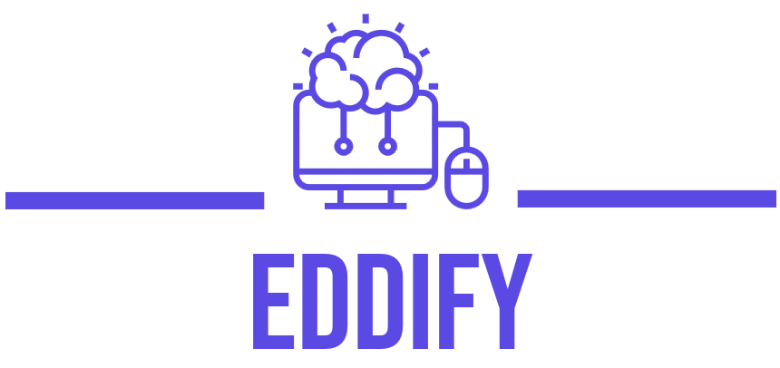

# EDDIFY - A E-Learining Platform For Students

## 🚀 Welcome to EDDIFY: Your Gateway to Limitless Learning 🚀

Welcome to EDDIFY, where learning knows no bounds! As your premier e-learning platform, EDDIFY is crafted to unleash your intellectual potential and guide you on a journey of continuous education. Whether you're a seasoned professional, a student eager to explore new horizons, or someone embarking on a lifelong learning adventure, EDDIFY is your trusted companion.

## EDDIFY API LINK
Explore the EDDIFY API for various functionalities:

- [GET All Users](http://0.0.0.0:5000/api/v1/users) - Retrieves the list of all user objects or a specific user.
- [GET User by ID](http://0.0.0.0:5000/api/v1/users/{user_id}) - Retrieves details of a specific user by user ID.
- [DELETE User by ID](http://0.0.0.0:5000/api/v1/users/{user_id}) - Deletes a user object by user ID.
- [User Signup API](http://0.0.0.0:5000/api/v1/signup/) - Creates a new user.
- [User Login API](http://0.0.0.0:5000/api/v1/login/) - Logs in a user.
- [Authenticate User](http://0.0.0.0:5000/api/v1/auth/) - Authenticates a user based on the provided token.
- [PUT User by ID](http://0.0.0.0:5000/api/v1/users/{user_id}) - Updates user information by user ID.
## Table of Contents

- [Introduction](#)
- [Key Features](#key-features)
- [Testing](#testing)
- [Technologies Used](#technologies-used)
- [Getting Started](#getting-started)

## Key Features

1. **Extensive Course Catalog:** A diverse and comprehensive library of courses covering a wide range of subjects and industries.
2. **Adaptive Learning Paths:** Personalized learning experiences that adapt to the learner's pace, skill level, and preferred learning style.
3. **Expert Instructors:** Courses led by industry professionals and subject matter experts, providing valuable real-world insights.
4. **Collaborative Learning Community:** A vibrant community where learners can connect, collaborate, and share knowledge with peers and mentors.
5. **Mobile Accessibility** Responsive design or a dedicated mobile app for seamless learning experiences on various devices.
6. **Progress Tracking and Analytics:** Tools that allow learners to track their progress, receive performance analytics, and identify areas for improvement.
7. **User-Friendly Interface:** Intuitive and user-friendly interface for easy navigation and a positive user experience.
8. **Accessibility Features:** Inclusion of accessibility features to ensure that the platform is usable by individuals with diverse abilities.

## Testing

We've thoroughly tested our platform to ensure a smooth and efficient user experience. If you face any issues, feel free
to reach out

## Technologies Used

- Python
- MySQL
- Flask

## Deployed Site

Explore EDDIFY now: [EDDIFY Platform](https://eddify-frontend.onrender.com/) 

## Final Project Blog Article

Read about the journey of building EDDIFY: [EDDIFY Project Blog](https://medium.com/@kasshymoni0812/announcing-eddify1-0-f22a8a8d7c0a) 

## Authors

- [Adeniran Timilehin](https://www.linkedin.com/in/timilehin-adeniran-342710234?utm_source=share&utm_campaign=share_via&utm_content=profile&utm_medium=android_app) - [LinkedIn](https://www.linkedin.com/in/timilehin-adeniran-342710234?utm_source=share&utm_campaign=share_via&utm_content=profile&utm_medium=android_app) 
- [Oke Kolawole](https://www.linkedin.com/in/kolawole-sunday-oke-38b1871a3/) - [LinkedIn](https://www.linkedin.com/in/kolawole-sunday-oke-38b1871a3/)